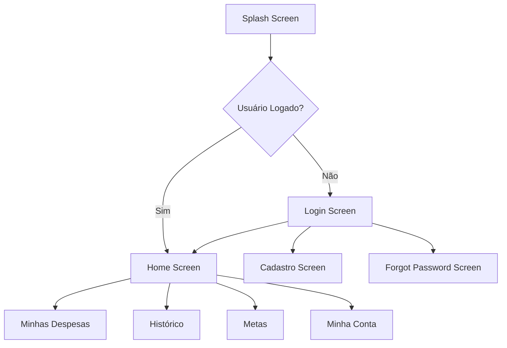

# 📚 Documentação Completa - Frontend ZetaFin

## 📋 Índice

1. [Visão Geral](#visão-geral)
2. [Arquitetura](#arquitetura)
3. [Estrutura de Pastas](#estrutura-de-pastas)
4. [Tecnologias Utilizadas](#tecnologias-utilizadas)
5. [Fluxos de Navegação](#fluxos-de-navegação)
6. [Telas e Funcionalidades](#telas-e-funcionalidades)
7. [Componentes Compartilhados](#componentes-compartilhados)
8. [Gerenciamento de Estado](#gerenciamento-de-estado)
9. [Serviços e APIs](#serviços-e-apis)
10. [Responsividade](#responsividade)
11. [Autenticação e Segurança](#autenticação-e-segurança)
12. [Guia de Desenvolvimento](#guia-de-desenvolvimento)
13. [Testes](#testes)
14. [Deploy](#deploy)

---

## 🎯 Visão Geral

O **ZetaFin** é uma aplicação de gestão financeira pessoal desenvolvida em Flutter, projetada para funcionar em múltiplas plataformas (Web, Desktop, Mobile). O objetivo é fornecer controle total sobre finanças pessoais, incluindo receitas, despesas, metas financeiras e análises inteligentes.

### Características Principais

- ✅ **Multiplataforma**: Web, Desktop (Windows, macOS, Linux), Mobile (iOS, Android)
- ✅ **Responsive Design**: Layouts otimizados para mobile (< 800px) e desktop (≥ 800px)
- ✅ **Autenticação JWT**: Login seguro com tokens
- ✅ **OCR Inteligente**: Processamento automático de recibos
- ✅ **Análises Financeiras**: Dashboards e insights em tempo real
- ✅ **Metas Compartilhadas**: Sistema de metas individuais e colaborativas
- ✅ **Modo Escuro/Claro**: Temas customizáveis

---

## 🏗️ Arquitetura

### Padrão de Arquitetura

O projeto utiliza uma arquitetura **Feature-First** combinada com princípios de **Clean Architecture**:

```
┌─────────────────────────────────────────────┐
│            Presentation Layer               │
│  (Screens, Widgets, Controllers)            │
├─────────────────────────────────────────────┤
│            Business Logic Layer             │
│  (Services, Repositories, Models)           │
├─────────────────────────────────────────────┤
│            Data Layer                       │
│  (API Clients, Local Storage)               │
└─────────────────────────────────────────────┘
```

### Princípios Seguidos

1. **Separation of Concerns**: Cada camada tem responsabilidades bem definidas
2. **Dependency Injection**: Uso de Provider para injeção de dependências
3. **Single Responsibility**: Classes com propósito único
4. **DRY (Don't Repeat Yourself)**: Componentes reutilizáveis
5. **SOLID Principles**: Código manutenível e escalável

---

## 📁 Estrutura de Pastas

```
lib/
│
├── assets/                          # Recursos estáticos
│   ├── images/                      # Imagens
│   ├── icons/                       # Ícones customizados
│   └── fonts/                       # Fontes personalizadas
│
├── core/                            # Módulo Core (Compartilhado)
│   ├── constants/                   # Constantes globais
│   │   ├── api_constants.dart
│   │   ├── app_constants.dart
│   │   └── route_constants.dart
│   │
│   ├── routes/                      # Configuração de rotas
│   │   └── go_router.dart
│   │
│   ├── services/                    # Serviços globais
│   │   ├── dio_client.dart         # Cliente HTTP
│   │   └── transaction_service.dart # Serviço de transações
│   │
│   ├── state/                       # Estados globais
│   │   └── app_state.dart
│   │
│   └── theme/                       # Temas da aplicação
│       ├── app_colors.dart
│       ├── app_text_styles.dart
│       └── app_theme.dart
│
├── features/                        # Funcionalidades (Feature-First)
│   │
│   ├── auth/                        # Autenticação
│   │
│   ├── expenses/                    # Gestão de Despesas
│   │   ├── controllers/
│   │   │   └── transaction_controller.dart
│   │   ├── models/
│   │   │   ├── transaction_model.dart
│   │   │   ├── receipt_model.dart
│   │   │   └── ocr_data_model.dart
│   │   └── widgets/
│   │       └── add_transaction_popup.dart
│   │
│   ├── goals/                       # Metas Financeiras
│   │   ├── controllers/
│   │   │   └── user_auth_controller.dart
│   │   ├── models/
│   │   │   └── user_model.dart
│   │   ├── screens/
│   │   │   ├── expenses/
│   │   │   │   └── desktop/
│   │   │   │       └── expenses_desktop_screen.dart
│   │   │   ├── goal/
│   │   │   │   └── desktop/
│   │   │   │       └── goals_desktop.dart
│   │   │   ├── home/
│   │   │   │   ├── desktop/
│   │   │   │   │   └── home_desktop.dart
│   │   │   │   ├── mobile/
│   │   │   │   │   └── home_screen.dart
│   │   │   │   └── home_responsive.dart
│   │   │   ├── login/
│   │   │   │   ├── desktop/
│   │   │   │   │   ├── login_desktop_layout.dart
│   │   │   │   │   ├── cadastro_desktop_layout.dart
│   │   │   │   │   └── forgot_password_desktop.dart
│   │   │   │   ├── mobile/
│   │   │   │   │   ├── login_mobile_layout.dart
│   │   │   │   │   ├── cadastro_screen.dart
│   │   │   │   │   └── forgot_password_screen.dart
│   │   │   │   ├── login_responsive_screen.dart
│   │   │   │   ├── cadastro_responsive_screen.dart
│   │   │   │   └── forgot_response.dart
│   │   │   └── myAccount/
│   │   ├── widgets/
│   │   │   ├── menu_desktop.dart
│   │   │   ├── menu_mobile.dart
│   │   │   └── user_menu_desktop.dart
│   │   └── repositories/
│   │
│   ├── deposits/                    # Depósitos
│   │
│   └── users/                       # Usuários
│
├── shared/                          # Componentes Compartilhados
│   ├── layouts/
│   │   ├── responsive_builder.dart
│   │   └── responsive.dart
│   │
│   └── widget/
│       ├── custom_button.dart
│       ├── custom_text_field.dart
│       └── social_auth_button.dart
│
└── main.dart                        # Entry Point
```

---

## 🛠️ Tecnologias Utilizadas

### Dependências Principais

```yaml
dependencies:
  # Core Flutter
  flutter:
    sdk: flutter
  
  # Estado e Navegação
  provider: ^6.1.1              # Gerenciamento de estado
  go_router: ^13.0.0            # Navegação declarativa
  
  # HTTP e API
  dio: ^5.4.0                   # Cliente HTTP
  shared_preferences: ^2.2.2    # Armazenamento local
  
  # UI e Design
  google_fonts: ^6.1.0          # Fontes do Google
  percent_indicator: ^4.2.3     # Indicadores de progresso
  
  # Utilitários
  file_picker: ^6.1.1           # Seleção de arquivos
  
  # Segurança
  flutter_secure_storage: ^9.0.0  # Armazenamento seguro
```

### Dependências de Desenvolvimento

```yaml
dev_dependencies:
  flutter_test:
    sdk: flutter
  flutter_lints: ^3.0.0
  mockito: ^5.4.4               # Mocks para testes
  build_runner: ^2.4.8          # Code generation
```

---

## 🔄 Fluxos de Navegação

### Fluxo Principal



### Rotas Definidas

**`lib/core/routes/go_router.dart`**

| Rota | Tela | Autenticação |
|------|------|--------------|
| `/` | Splash/Redirect | - |
| `/login` | Login Responsive | ❌ Não |
| `/cadastro` | Cadastro Responsive | ❌ Não |
| `/forgot-password` | Forgot Password Responsive | ❌ Não |
| `/home` | Home Responsive | ✅ Sim |
| `/expenses` | Expenses Desktop | ✅ Sim |
| `/history` | History (futuro) | ✅ Sim |
| `/goals` | Goals Desktop | ✅ Sim |
| `/my-account` | My Account (futuro) | ✅ Sim |

### Redirecionamento Automático

```dart
redirect: (context, state) {
  final logged = isLoggedIn;
  final loggingIn = state.matchedLocation == '/login' || 
                    state.matchedLocation == '/cadastro';

  if (!logged && !loggingIn) return '/login';
  if (logged && loggingIn) return '/home';
  return null;
}
```

---

## 📱 Telas e Funcionalidades

### 1. 🔐 Login / Cadastro

#### Login Screen

**Responsivo:** Mobile (< 800px) | Desktop (≥ 800px)

**Arquivo:** 
- Mobile: `lib/features/goals/screens/login/mobile/login_mobile_layout.dart`
- Desktop: `lib/features/goals/screens/login/desktop/login_desktop_layout.dart`
- Responsivo: `lib/features/goals/screens/login/login_responsive_screen.dart`

**Funcionalidades:**
- ✅ Login com e-mail e senha
- ✅ Validação de campos
- ✅ Feedback visual de erros
- ✅ Loading state durante autenticação
- ✅ Google Sign In (placeholder)
- ✅ Apple Sign In (placeholder)
- ✅ Link para "Esqueci minha senha"
- ✅ Link para cadastro

**Campos:**
- E-mail (com validação de formato)
- Senha (mínimo 6 caracteres, com toggle de visibilidade)

**Fluxo:**
```
1. Usuário insere e-mail e senha
2. Valida campos localmente
3. Envia para API: POST /api/Auth/login
4. Recebe JWT token
5. Armazena token no SharedPreferences
6. Redireciona para /home
```

**Controller:** `AuthController` (`user_auth_controller.dart`)

---

#### Cadastro Screen

**Responsivo:** Mobile | Desktop

**Arquivo:** 
- Mobile: `lib/features/goals/screens/login/mobile/cadastro_screen.dart`
- Desktop: `lib/features/goals/screens/login/desktop/cadastro_desktop_layout.dart`
- Responsivo: `lib/features/goals/screens/login/cadastro_responsive_screen.dart`

**Funcionalidades:**
- ✅ Cadastro com nome, e-mail e senha
- ✅ Validação de campos
- ✅ Feedback visual de erros
- ✅ Loading state
- ✅ Google Sign In (placeholder)
- ✅ Apple Sign In (placeholder)
- ✅ Link para login

**Campos:**
- Nome completo
- E-mail (com validação)
- Senha (mínimo 6 caracteres)

**Fluxo:**
```
1. Usuário preenche dados
2. Valida campos
3. Envia para API: POST /api/Users
4. Confirma sucesso
5. Redireciona para /login
```

**Repository:** `AuthRepository` (`user_auth_repository.dart`)

---

#### Forgot Password Screen

**Responsivo:** Mobile | Desktop

**Arquivo:**
- Mobile: `lib/features/goals/screens/login/mobile/forgot_password_screen.dart`
- Desktop: `lib/features/goals/screens/login/desktop/forgot_password_desktop.dart`
- Responsivo: `lib/features/goals/screens/login/forgot_response.dart`

**Funcionalidades:**
- ✅ Solicitar link de redefinição
- ✅ Validação de e-mail
- ✅ Feedback de envio
- ✅ Link para voltar ao login

**Campos:**
- E-mail

**Fluxo:**
```
1. Usuário insere e-mail
2. Valida formato
3. Envia requisição (simulada por enquanto)
4. Mostra mensagem de sucesso
5. Retorna para /login
```

---

### 2. 🏠 Home Screen

**Responsivo:** Mobile | Desktop

**Arquivo:**
- Mobile: `lib/features/goals/screens/home/mobile/home_screen.dart`
- Desktop: `lib/features/goals/screens/home/desktop/home_desktop.dart`
- Responsivo: `lib/features/goals/screens/home/home_responsive.dart`

#### Desktop Layout

**Componentes:**
1. **Header**
   - Saudação personalizada
   - User Menu (foto, nome, e-mail, logout)

2. **Controle Pessoal** (Cards)
   - 💰 Receitas: R$ 8.450,00 (+12.5%)
   - 💸 Despesas: R$ 4.320,00 (-8.3%)
   - 💵 Saldo Disponível: R$ 4.130,00 (+4.2%)
   - 📋 Contas a Pagar: R$ 1.250,00 (3 pendentes)

3. **Minhas Metas** (Seção)
   - Cards de metas em progresso
   - Barra de progresso
   - Prazo e valor alvo
   - Cálculo de aporte mensal necessário
   - **Card "Total de Metas"** com botão "Gerenciar Metas"
     - Clique abre popup `GoalsForPinPopup`
     - Permite fixar/desfixar metas na home

4. **Transações Recentes** (Tabela)
   - Avatar do usuário
   - Descrição
   - Categoria
   - Data
   - Valor (verde para receita, preto para despesa)
   - Tipo (badge colorido)
   - Botão "Nova Transação"

**Menu Lateral:**
- 🏠 Home
- 💳 Minhas Despesas
- 📊 Histórico
- 🎯 Metas

#### Mobile Layout

**Componentes:**
1. **Header**
   - "Bom dia, [Nome]"

2. **Card Saldo Total**
   - Valor total
   - Última atualização
   - Progresso visual
   - Botão "History"
   - Link "View Share Notice Details"

3. **Card Progresso**
   - Indicador circular
   - Percentual de objetivo alcançado

4. **Menu Flutuante** (Bottom Navigation)
   - 🏠 Home
   - 📊 Menu

**Widget:** `MobileBottomNav` (`menu_mobile.dart`)

---

### 3. 💳 Minhas Despesas

**Desktop Only**

**Arquivo:** `lib/features/goals/screens/expenses/desktop/expenses_desktop_screen.dart`

**Layout Completo:**

#### Header
- Título: "Minhas Despesas"
- Subtítulo: "Controle total das suas finanças"
- **Botão "Nova Transação"** → Abre `AddTransactionPopup`
- User Menu

#### 1. Visão Geral Financeira (Card Gradiente Azul)
- **Saldo Disponível**: R$ 3.680,00 de R$ 8.000,00
- **Percentual Gasto**: 54%
- Quick Stats:
  - Total Gasto: R$ 4.320,00
  - Economia do Mês: R$ 3.680,00

#### 2. Dashboard de Controle (Row com 2 colunas)

**Coluna Esquerda (flex: 2):**

1. **Distribuição de Gastos**
   - Contas Fixas: 47.5% (ideal ≤50%)
   - Contas Variáveis: 23.4% (ideal ≤30%)
   - Gastos Desnecessários: 5% (ideal ≤20%)
   - Barras de progresso coloridas

2. **Limite de Gastos Livres**
   - Cálculo: Renda - Fixas - Poupança
   - Valor gasto vs. Limite
   - Status: OK / ATENÇÃO
   - Barra de progresso (verde/amarelo/vermelho)

3. **Evolução dos Gastos** (Chart)
   - Últimos 4 meses
   - Barras animadas
   - Mês atual destacado

**Coluna Direita (flex: 1):**

1. **Meta de Economia** (Card Verde)
   - Valor economizado
   - Meta mensal
   - Percentual alcançado
   - Barra de progresso

2. **Saúde Financeira**
   - Reserva de Emergência: 50%
   - Controle de Gastos: 85%
   - Meta de Poupança: 91%
   - Barras coloridas

3. **Insights Rápidos**
   - ⬇️ "Você gastou 8% a menos que o mês passado"
   - ⚠️ "Delivery subiu 35% este mês"
   - ⭐ "Meta de economia quase atingida!"

#### 3. Análise Detalhada por Categoria (Tabs)
- **Fixas**: Lista com vencimentos
  - Aluguel, Internet, Academia, etc.
- **Variáveis**: Lista com categorias
  - Supermercado, Uber, Restaurantes, etc.
- **Desnecessários**: Lista com alertas
  - Assinaturas não usadas, compras impulsivas, etc.

#### 4. Seu Consultor Financeiro (Cards Informativos)
- 💰 Custo Real do Consumo por Impulso
- 📊 Comparativo com o Ideal
- 🎯 Reserva de Emergência
- 💎 Simulação de Investimento

#### 5. Seu Progresso Financeiro (Card Roxo com Gradiente)
- Badges de conquistas:
  - 🎯 Economizador Nível 3
  - 📊 Controle Total
  - 💎 Investidor Iniciante
  - 🧠 Planejador Mestre
- Próxima conquista com barra de progresso

**Controller:** `TransactionController` (`transaction_controller.dart`)

---

### 4. 🎯 Metas

**Desktop Only**

**Arquivo:** `lib/features/goals/screens/goal/desktop/goals_desktop.dart`

**Layout:**

#### Header
- Título: "Minhas Metas Financeiras"
- Subtítulo: "Planeje, economize e alcance seus objetivos 🎯"
- User Menu

#### 1. Cards de Estatísticas (Row com 4 cards)
- **Metas Ativas**: 3 (+1 este mês)
- **Total Economizado**: R$ 9.500 (+12% vs mês anterior)
- **Metas Concluídas**: 1 (100% de sucesso)
- **Próximo Aporte**: R$ 500 (em 5 dias)

#### 2. Filtros e Controles de Visualização
**Filtros (Chips):**
- Todas
- Em andamento
- Atrasadas
- Concluídas
- Compartilhadas

**Visualização (Toggle):**
- 📱 Cards (Grid 2 colunas)
- 📋 Lista (Tabela)
- 📅 Timeline (Cronológica)

#### 3. Metas (Diferentes visualizações)

**Dados de cada meta:**
- Nome
- Descrição
- Valor alvo
- Valor atual
- Prazo
- Categoria
- Status (Em andamento / Atrasada / Concluída)
- Compartilhada (sim/não)
- Prioridade (alta/média/baixa)
- Contribuintes (se compartilhada)
- Histórico de aportes
- Cálculo de aporte mensal necessário

**Exemplo de Metas:**
1. **Viagem à Europa**: R$ 4.500 / R$ 15.000 (30%)
   - Prazo: 31/12/2025
   - Compartilhada com Maria
   - Aporte sugerido: R$ 1.500/mês

2. **Reserva de Emergência**: R$ 18.000 / R$ 30.000 (60%)
   - Prazo: 30/06/2026
   - Individual
   - Alta prioridade

3. **Curso de UX Design**: R$ 2.000 / R$ 2.000 (100%)
   - Concluída
   - ✅ Meta alcançada

4. **Carro Novo**: R$ 8.000 / R$ 20.000 (40%)
   - Prazo: 30/11/2025
   - Atrasada ⚠️

#### 4. Botão Flutuante "Nova Meta"
Clique abre modal com:
- Nome da Meta
- Descrição
- Valor Total
- Prazo
- Categoria (dropdown)
- Prioridade (dropdown)
- Periodicidade de Aportes
- Opções avançadas:
  - [ ] Meta compartilhada
  - [ ] Aportar valor inicial
  - [x] Ativar lembretes
  - [ ] Considerar rendimento

#### 5. Popup de Gerenciamento (GoalsForPinPopup)

**Trigger:** Clique no card "Total de Metas" na Home

**Funcionalidades:**
- Buscar metas
- Filtrar por categoria
- **Fixar/Desfixar metas** na Home (toggle pin)
- Ver metas fixadas vs. outras metas
- Preview com valor e progresso
- Salvar alterações

**Seções:**
1. **Fixadas na Home** (destacadas)
2. **Outras Metas** (disponíveis para fixar)

**Estado:**
- Máximo 3 metas fixadas (recomendado)
- Animações de entrada/saída
- Feedback visual ao fixar/desfixar

---

### 5. 💵 Nova Transação (Popup)

**Widget:** `AddTransactionPopup` (`add_transaction_popup.dart`)

**Trigger:**
- Botão "Nova Transação" na tela de Despesas
- Botão "Nova Transação" na Home (futuro)

**Layout:**

#### Header (Gradiente Azul)
- Ícone
- Título: "Nova Transação"
- Subtítulo: "Adicione receitas ou despesas de forma inteligente"
- Botão fechar

#### Tabs
1. **💰 Receitas**
2. **💸 Despesas**

---

#### Tab: Receitas

**Campos:**
1. **Valor** (obrigatório)
   - Placeholder: "R$ 0,00"
   - Teclado numérico
   - Icon: attach_money

2. **Descrição** (obrigatório)
   - Placeholder: "Ex: Salário de Outubro"
   - Icon: description

3. **Categoria** (obrigatório, dropdown)
   - Salário
   - Freelance
   - Investimentos
   - Aluguel Recebido
   - Bônus
   - Outros
   - Icon: category

4. **Data de Recebimento** (obrigatório)
   - Date Picker
   - Icon: calendar

**Botão:** "Adicionar Receita" (verde)

**Fluxo:**
```
1. Usuário preenche campos
2. Valida localmente
3. Envia para API: POST /transactions
   {
     "type": "income",
     "value": 5000.00,
     "description": "Salário de Outubro",
     "category": "Salário",
     "date": "2025-10-25"
   }
4. Mostra loading
5. Recebe resposta
6. Mostra snackbar de sucesso
7. Fecha popup com resultado = true
8. Tela pai recarrega dados
```

---

#### Tab: Despesas

**Seção 1: Upload de Recibo (Opcional)**

**Área de Upload:**
- Estado vazio:
  - ☁️ Ícone de upload
  - "Clique para fazer upload do recibo"
  - "Formatos aceitos: JPG, PNG, PDF"

- Com arquivo:
  - ✅ Nome do arquivo
  - "Recibo processado com sucesso"
  - Botão remover

- Processando OCR:
  - 🔄 Loading spinner
  - "Processando recibo..."

**Fluxo OCR:**
```
1. Usuário seleciona arquivo
2. Faz upload: POST /receipts/upload
3. Backend processa com Google Vision API
4. Retorna dados extraídos:
   {
     "extractedValue": 125.50,
     "extractedDate": "2025-11-04",
     "merchantName": "Supermercado Extra",
     "items": [...],
     "confidence": 0.95
   }
5. Preenche campos automaticamente
6. Usuário pode ajustar se necessário
```

**Seção 2: Informações da Despesa**

**Tipo de Despesa** (obrigatório, seleção visual)
- 🧾 Contas Fixas (azul)
- 🛒 Contas Variáveis (laranja)
- ⚠️ Gastos Desnecessários (rosa)

**Campos:**
1. **Valor** (obrigatório)
2. **Descrição** (obrigatório)
3. **Categoria** (obrigatório, dropdown)
   - Alimentação
   - Transporte
   - Moradia
   - Saúde
   - Educação
   - Lazer
   - Compras
   - Contas Fixas
   - Outros

4. **Data da Despesa** (obrigatório)

**Botão:** "Adicionar Despesa" (rosa)

**Fluxo com Recibo:**
```
1. Upload do recibo
2. OCR processa e preenche campos
3. Usuário valida/ajusta
4. Envia: POST /transactions
   {
     "type": "expense",
     "value": 125.50,
     "description": "Supermercado Extra",
     "category": "Alimentação",
     "expenseType": "variaveis",
     "date": "2025-11-04",
     "hasReceipt": true
   }
5. Backend vincula recibo à transação
6. Retorna sucesso
7. Fecha popup e recarrega
```

**Validações:**
- Valor deve ser > 0
- Todos os campos obrigatórios preenchidos
- Data não pode ser futura (para despesas)
- Tipo de despesa obrigatório para despesas
- Arquivo máximo: 10MB
- Formatos aceitos: JPG, PNG, PDF

---

## 🧩 Componentes Compartilhados

### 1. Custom Button

**Arquivo:** `lib/shared/widget/custom_button.dart`

**Props:**
- `text`: String (obrigatório)
- `onPressed`: VoidCallback (obrigatório)
- `isLoading`: bool (default: false)
- `isOutlined`: bool (default: false)
- `backgroundColor`: Color?
- `textColor`: Color?
- `icon`: IconData?
- `width`: double?

**Variantes:**
- Primary (preenchido)
- Outlined (borda)
- With Icon
- Loading state

**Uso:**
```dart
CustomButton(
  text: 'Entrar',
  onPressed: _login,
  isLoading: _isLoading,
)
```

---

### 2. Custom Text Field

**Arquivo:** `lib/shared/widget/custom_text_field.dart`

**Props:**
- `labelText`: String (obrigatório)
- `hintText`: String (obrigatório)
- `prefixIcon`: IconData?
- `controller`: TextEditingController?
- `keyboardType`: TextInputType?
- `isPassword`: bool (default: false)
- `validator`: String? Function(String?)?

**Funcionalidades:**
- Label flutuante
- Validação customizada
- Toggle de visibilidade para senha
- Ícones prefix
- Estados: normal, focado, erro
- Estilo consistente

**Uso:**
```dart
CustomTextField(
  labelText: 'E-mail',
  hintText: 'seu@email.com',
  controller: _emailController,
  prefixIcon: Icons.email_outlined,
  keyboardType: TextInputType.emailAddress,
  validator: (value) {
    if
